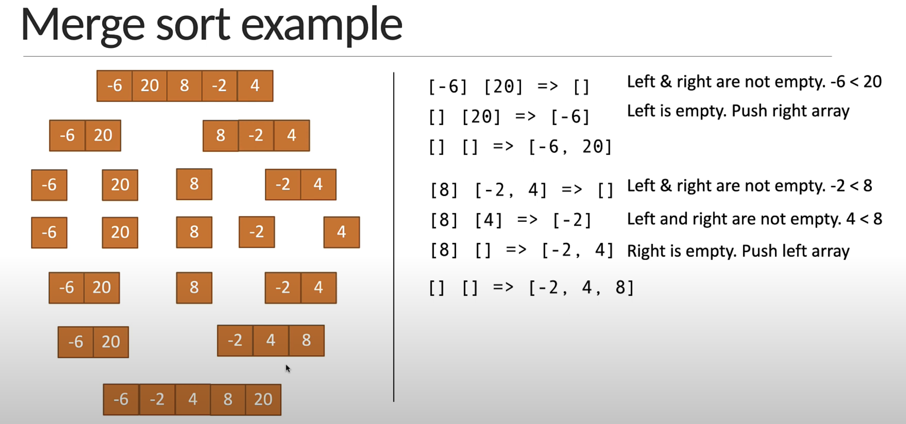
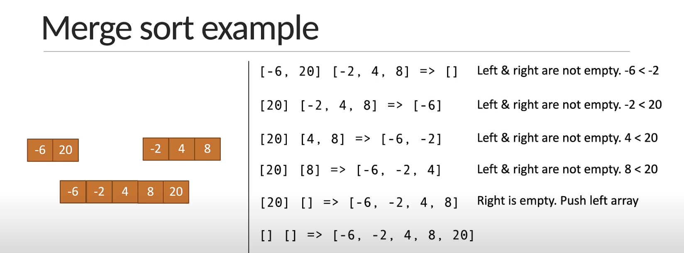

# DSA Practise
 - An algorithm is the set of well-defined instructions to solve a particular problem

## Space Complexity


## Big O Trend


## Big O Guide - Cheat Sheet


## Few points to note
 - Multiple algorithms exist for the same problem and there is no one right solution. Different algorithms work well under different constraints.
 - The same algorithm with the same programming language can be implemented in different ways.

# Math Algorithms
 - Fibonacci sequence
 - Factorial of a number
 - Prime number
 - Power of two
 - Recursion

## Recursion
Its a technique in JS that a function calls itself until a specific base condition is met. This approach is particularly useful for solving problems that can be naturally broken down into smaller, similar sub-problems. 


### 1. Recursion Fibonacci

The Fibonacci sequence is a series of numbers where each number is the sum of the two preceding ones, typically starting with 0 and 1.

In general, lets say ``F(n) = F(n-1) + F(n-2)`` with the base condition of F(0) = 0 and F(1) = 1

``` jsx
function recursiveFibonacci(n) {
  if (n < 2) {
    return n;
  }
  return recursiveFibonacci(n - 1) + recursiveFibonacci(n - 2);
}

console.log(recursiveFibonacci(0)); // 0
console.log(recursiveFibonacci(1)); // 1
console.log(recursiveFibonacci(2)); // 1
console.log(recursiveFibonacci(3)); // 2
console.log(recursiveFibonacci(4)); // 3
console.log(recursiveFibonacci(5)); // 5
console.log(recursiveFibonacci(6)); // 8

//Big 0 Time Complexity - 0(n^2)
```
#### Explanation for Time Complexity for Recursion Fibonacci


- With the above screenshot, the each number has 2 preceeding values and The recursive time complexity for each iteration is 2^n. So, the time complexity for the Big O notation is ***0(n^2)**

### 2. Recursion Factorial
The factorial of a non-negative integer 'n' (denoted as n!) is the product of all positive integers less than or equal to 'n'.

For Example, 
```jsx
  5! = 5 * 4 * 3 * 2 * 1 = 120
  4! = 4 * 3 * 2 * 1 = 24
  3! = 3 * 2 * 1 = 6
  2! = 2 * 1 = 2
  1! = 1
  0! = 1 // as per the math algorithm
```

To generalise the recursion for the factorial,

```jsx
5! = 5 * 4!
4! = 4 * 3!
3! = 3 * 2!
2! = 2 * 1!
```

So, now we can prepare the formulae i.e., **n! = n * (n-1)!**

```jsx
function recursiveFactorial(n) {
  if (n === 0) return 1;

  return n * recursiveFactorial(n - 1);
}

console.log(recursiveFactorial(0)); // 0
console.log(recursiveFactorial(1)); // 1
console.log(recursiveFactorial(2)); // 1
console.log(recursiveFactorial(3)); // 2
console.log(recursiveFactorial(5));

//Big 0 Time Complexity - 0(n)
```

#### Explanation for Time Complexity for Recursion Factorial
- Each number executes 5 times. i.e., 5 executes 5 times, 5x4x3x2x1. Then 4 executes 4 times, ie., 4x3x2x1. As n increases the no.of instructions increases at the same pace. So, Big O is Linear Time complexity in the case of Recursive Factorial of a number. So, it is **0(n)**


# Search Algorithm
1. Linear Search
2. Binary Search
3. Recursive Binary Search

> Note: The approach remains the same as Math Algorithms

## 1. Linear Search Psuedo Code - Finding the index of a given number
**Problem** - Given a array of 'n' elements and a target element 't', find the index of 't' in the array. Return -1 if the target element is not found.

> Problem: arr = [-5, 2, 10, 4, 6]; // Should return 2

- Start at the first element in the array and move towards the last.
- At each element though, check if the element is equal to the target element.
- If element found, return the index of the element If element not found, return -1

**Solution: 1**
``` jsx
function linearSearch (arr, target) {
  for (let i = 0; i ‹ arr.length; i++) {
    if (arr[i] === target） {
      return i
    }
  }
  return -1
}
console.log(linearSearch ([-5, 2, 10, 4, 6], 10)) // 2 console. log(linearSearch([-5, 2, 10,4, 61, 6)) // 4
console.log(linearSearch([-5, 2, 10,4, 61, 20)) // -1
```

**Solution: 2**

```jsx
function linearSearch(n) {
  const arr = [-5, 2, 10, 4, 6];
  return arr.findIndex((ele) => ele === n);
}

console.log(linearSearch(10)); // Should return 2
console.log(linearSearch(6)); // Should return 4
console.log(linearSearch(20)); // Should return -1
```

#### Time Complexity

 - Our Function contains only 1 for loop and by our cheat sheet(attached in the top of the Readme), for loop the Big O is Linear Time Complexity. The number of values increases the number of execution also increases.
 - So, Big O is  ***0(n)***


## 2. Binary Seach
**Problem** - Given a sorted array of 'n' elements and a target element 't', find the index of 't' in the array. Return -1 if the target element is not found.

```jsx
arr = [1-5, 2, 4, 6, 10], t = 10 -> Should return 4
arr = [-5, 2, 4, 6, 10], t = 6 -> Should return 3
```

> NOTEℹ️: Binary Search only works on sorted arrays. We can also do a linear search by sorting an array first and then apply Binary Search.


### Binary Search Psuedo Code - Finding the index of a given number


- If the array is empty, return -1 as the element cannot be found.
- If the array has elements, find the middle element in the array. If target is equal to the middle element, return the middle element index.
- If target is less than the middle element, binary search left half of the array.
- If target is greater than middle element, binary search right half of the array.

```jsx
function binarySearch(array, target) {
  let LeftIndex = 0;
  let RightIndex = array.length - 1

  while(LeftIndex <= RightIndex) {
    let middleIndex = Math.floor((LeftIndex + RightIndex) / 2);
    if (target < array[middleIndex]) {
      RightIndex = middleIndex - 1;
    }
    else
      if (target > array[middleIndex])
        LeftIndex = middleIndex + 1;
      else
        if (target === array[middleIndex])
          return middleIndex
  }
  return -1;
}

console.log(binarySearch([-3, -2, 1, 2, 3, 5], 2)); // Should return 3
```
#### Time Complexity

The function reduces by half when the iteration continues, as per the cheat sheet if it reduces by half then the Big O is also logarithmic **O(log n)**

## 3. Recursive Binary Search

``` jsx
function recursiveBinarySearch(array, target) {
  let LeftIndex = 0;
  let rightIndex = array.length - 1;
  return search(array, target, LeftIndex, rightIndex)
}

function search(array, target, LeftIndex, rightIndex) {
  while (LeftIndex <= rightIndex) {
    let middleIndex = Math.floor((LeftIndex + rightIndex) / 2);
    if (target === array[middleIndex]) {
        return middleIndex;
    }
    if (target < array[middleIndex])
        return search(array, target, LeftIndex, middleIndex - 1)
    else
        return search(array, target, middleIndex + 1, rightIndex)
  }
  return -1
}

console.log(recursiveBinarySearch([-3, -2, 1, 2, 3, 5], 5)); // Should return 5
```
#### Time Complexity

The function reduces by half when the iteration continues, as per the cheat sheet if it reduces by half then the Big O is also logarithmic **O(log n)**


# Sort Algorithm
- Bubble Sort
- Insertion Sort
- Quick Sort
- Merge Sort

> The approach remains the same as Math and Search Algorithms

## Bubble sort
### Problem - Given an array of integers, sort the array.
const arr = [-6, 20, 8, -2, 4]
bubbleSort(arr) => Should return [-6, -2, 4, 8, 20]

### Solution
  - We know that we start the first element in the array and compare it wih the adjacent element till we reach the last element and that ***sounds like a loop***

```jsx
  function bubbleSort(arr) {
    let swapped;
    do {
      swapped = false;
      for(let i=0; i<arr.length - 1; i++) {
        if(arr[i] > arr[i+1]) {
            let temp = arr[i];
            arr[i] = arr[i+1]
            arr[i+1] = temp;
            swapped= true
        }
      }
    }
    while(swapped)
    
    return arr
  }

  console.log(bubbleSort([-6, 20, 8, -2, 4])) // [-6, -2, 4, 8, 20]
```

#### Time Complexity
Our code has 2 loops, for loop is nested inside do-while loop. From our sheet its pretty evident that it is quadratic time complexity 0(n^2)
 - If the array size increases, the number of comparisons increases for that square of a number.
 - Quadratic time complexity is great for sorting.


## Insertion Sort

### Problem - Given an array of integers, sort the array.
const arr= [-6, 20, 8, -2, 4]
insertionSort(arr) => Should return [-6, -2, 4, 8, 20]

### Insertion Sort Idea
- Virtually split the array into a sorted and an unsorted part
- Assume that the first element is already sorted and remaining elements are unsorted
- Select an unsorted element and compare with all elements in the sorted part
- If the elements in the sorted part is smaller than the selected element, proceed to the next element in the unsorted part. Else, shift larger elements in the sorted part towards the right.
- Insert the selected element at the right index
- Repeat till all the unsorted elements are placed in the right order

### Insertion Sort Example


```jsx
function insertionSort(arr) {
  for (let i = 1; i < arr.length; i++) {
    let numberToInsert = arr[i];
    let j = i - 1;

    while (j >= 0 && arr[j] > numberToInsert) {
      arr[j + 1] = arr[j]; // Shift element right
      j--;
    }

    arr[j + 1] = numberToInsert; // Insert at correct position
  }

  return arr;
}

```
#### Time Complexity
Big 0 - O(n^2)

## Quick sort
### Problem - Given an array of integers, sort the array.
const arr= [-6, 20, 8, -2, 4]
quickSort(arr) => Should return [-6, -2, 4, 8, 20]

### Quick sort idea
1. Identify the pivot element in the array
  - Pick first element as pivot
  - Pick last element as pivot (Our approach)
  - Pick a random element as pivot
  - Pick median as pivot
2. Put everything that's smaller than the pivot into a 'left' array and everything that's greater than the pivot into a 'right' array
3. Repeat the process for the individual 'left' and 'right' arrays till you have an array of length 1 which is sorted by definition
4. Repeatedly concatenate the left array, pivot and right array till one sorted array remains

### Quick Sort Example


```jsx
function quickSort(arr) {
  if (arr.length <= 1) return arr;

  let pivotEle = arr[arr.length - 1]
  let leftArr = []
  let rightArr = []
  for(let i= 0; i<arr.length -1; i++) {
    if(arr[i] < pivotEle) {
      leftArr.push(arr[i])
    }
    else {
      rightArr.push(arr[i])
    }
  }
  return [...quickSort(leftArr), pivotEle, ...quickSort(rightArr)]
}

console.log(quickSort([-6, 20, 8, -2, 4])) // [ -6, -2, 4, 8, 20 ]
```

#### Time Complexity
If the array is already sorted ---> Worst case Big 0 - O(n^2) & Avg case is O(nlog n)

> The average time complexity of Quick Sort is O(nlog n)

## Merge Sort

### Problem - Given an array of integers, sort the array.
const arr = [-6, 20, 8, -2, 4]
mergeSort(arr) => Should return [-6, -2, 4, 8, 20]

### Merge Sort Idea
1. Divide the array into sub arays, each containing only one element (An tray with one element is Considered Sorted)
2. Repeatedly merge the sub arrays to produce new sorted sub arrays until there is only one sub array remaining. That will be the sorted array.




# Misc Problems (Miscellaneous Problems)
1. Cartesian Product
2. Climbing Staircase
3. Tower of Hanoi

## 1. Cartesian Product

### Problem - Given two finite non-empty sets, find their Cartesian Product.
In mathematics, specifically set theory, the Cartesian product of two sets A and B, denoted AxB, is the set of all ordered pairs (a, b) where a is in A and b is in B

const A = [1, 2]
const B = [3, 4]

AxB = [ [1, 3], [1, 4], [2, 3], [2, 4]]

const C = [1, 2]
const D = [3, 4, 5]

CxD = [ [1, 3], [1, 4], [1, 5], [2, 3], [2, 4], [2, 5] ]

```jsx
const A = [1, 2]
const B = [3, 4]
let result = []

function cartesianProduct(a, b) {
  for(let i=0; i<=a.length - 1; i++) {
    for(let j = 0; j<=b.length-1; j++) {
      result.push([a[i], b[j]])
    }
  }

  return result 
}

console.log(cartesianProduct(A, B))
```

### Time Complexity

Big 0 - O(n^2)

## 2. Climbing Stair Case

### Problem - Given a staircase of 'n' steps, count the number of distinct ways to climb to the top.
You can either climb 1 step or 2 steps at a time.

#### Example
n=1, climbingStaircase(1) = 1     | (1)
n=2, climbingStaircase(2) = 2     | (1, 1) and (2)
n=3, climbingStaircase(3) = 3     | (1,1,1) (1, 2) and (2, 1)
n=4, climbingStaircase(4) = 5     | (1,1,1,1) (1,1,2) (1,2,1) (2,1,1) and (2,2)

#### Solution

- For reaching n steps, the chances are of two ways 1 step or 2 steps. Now, the solution to reach n steps are n-1 or n-2

> climbingStaircase(n) = climbingStaircase(n - 1) + climbingStaircase(n - 2)

The above looks like fibonnaci

```jsx
function climbingStaircase(n) {
    let noOfWays = [1, 2]
    for(let i =2; i<=n; i++) {
        noOfWays[i] = noOfWays[i - 1] + noOfWays[i - 2]
    }
    return noOfWays[n-1]
    
}

console.log(climbingStaircase(1)) // 1
console.log(climbingStaircase(2)) // 2
console.log(climbingStaircase(3)) // 3
console.log(climbingStaircase(4)) // 5
console.log(climbingStaircase(5)) // 8
```

### Time Complexity

Big 0 - O(n)

## 3. Tower of Hanoi
The objective of the puzzle is to move the entire stack to the last rod, obeying the following rules:

1. Only one disk may be moved at a time.
2. Each move consists of taking the upper disk from one of the stacks and placing it on top of another stack or on an empty rod. And lastly,
3. No disk may be placed on top of a disk that is smaller.


### Example Tower of Honai - 2 disks


### Example Tower of Honai - 3 disks


```jsx

function towerOfHonai(n, fromRod, usingRod, toRod) {
  if (n == 1) {
    console.log("Move "+ n +" from " + fromRod + " to " + toRod)
    return
  }
  towerOfHonai(n - 1, fromRod, toRod, usingRod)
  console.log("Move "+ n +" from " + fromRod + " to " + toRod)
  towerOfHonai(n - 1, usingRod, fromRod, fromRod)
}

//console.log(towerOfHonai(1, "A", "B", "C")) // 1
console.log(towerOfHonai(2, "A", "B", "C")) // 2
```

### Time Complexity

Big 0 - O(2 ^ n)


# Recap


## Algorithm Techniques


## Next Steps

Solve more problems
1. Finding the GCD using Euclidian algorithm
2. Finding permutations and combinations of a list of numbers
3. Finding the longest common substring in a given string
4. Knapsack problem
Watch the upcoming JavaScript Data Structures course